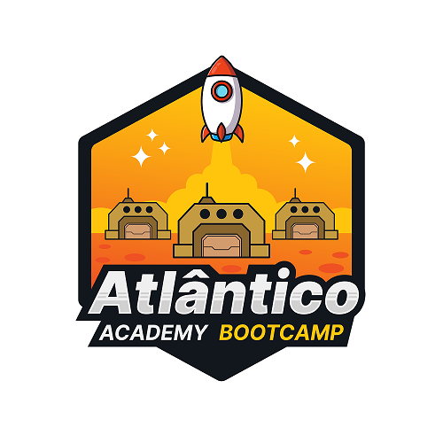

# Bootcamp-Atlantico_Academy

Repositório do curso de Machine Learning

## 🚀 Sobre

O [Instituto atlântico](https://www.atlantico.com.br/) é uma instituição de ciência e tecnologia (ICT), sendo uma das principais do nordeste em pesquisa. O [Atlântico Academy Bootcamp](https://www.atlantico.com.br/academy-bootcamp/) é um programa de capacitação gratuito. O Bootcamp, nada mais é, do que um treinamento intensivo para que seus estudantes absorvam o conhecimento teórico de maneira conjunta com a prática.

### 📋 Pré-requisitos

### 🔧 Instalação

## ⚙️ Executando os testes

### 🔩 Analise os testes de ponta a ponta

### ⌨️ E testes de estilo de codificação

## 📦 Implantação

## 🛠️ Construído com

* [Colab](https://colab.research.google.com) - O framework web usado
* [Visual Studio Code](https://code.visualstudio.com) - IDE utilizada
* [Pycharm](https://www.jetbrains.com/pycharm/) - IDE utilizada
* [Anaconda](https://www.anaconda.com) - Plataforma de Data Science
* [Kaggle](https://www.kaggle.com) - Plataforma de Pesquisas

## 🖇️ Colaborando

Por favor, leia o [COLABORACAO.md]() para obter detalhes sobre o nosso código de conduta e o processo para nos enviar pedidos de solicitação.

## 📌 Versão

## ✒️ Autores

* **Breno Sampaio** - *Desenvolvimento* - [Breno Sampaio](https://github.com/Brafps)
* **Herbert Hipolito** - *Desenvolvimento* - [Herbert Hipolito](https://github.com/HerbertHipolito)
* **Marcelo de Araújo** - *Desenvolvimento* - [Marcelo de Araújo](https://github.com/AIWASS23)

## 📄 Licença

Este projeto está sob a licença (MIT) - veja o arquivo [LICENSE.md](https://github.com/Brafps/Bootcamp-Atlantico_Academy/blob/main/LICENSE) para detalhes.

## 🎁 Expressões de gratidão

---
⌨️ com ❤️ por [Marcelo de Araújo](https://gist.github.com/AIWASS23) 😊

